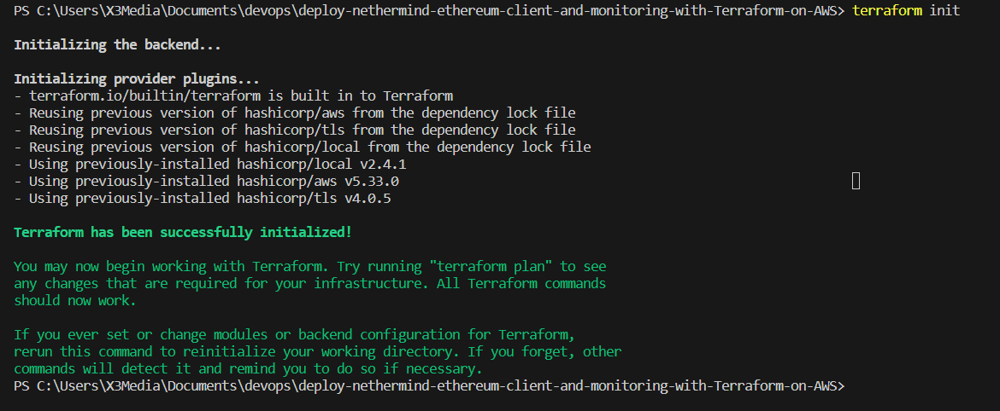
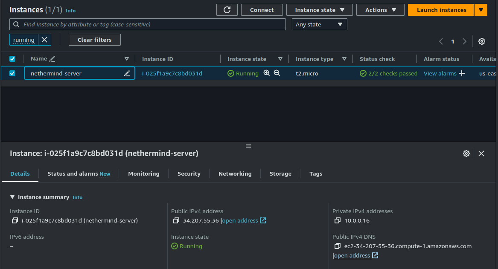
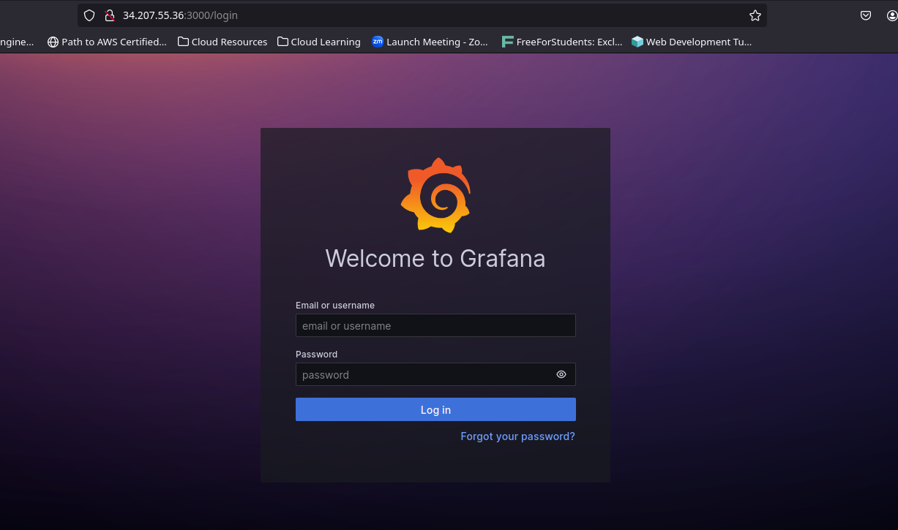
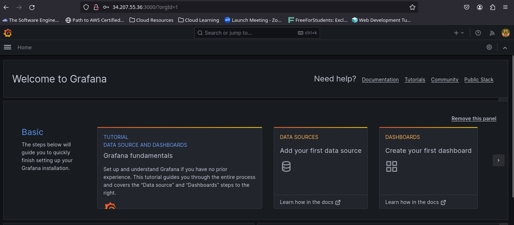
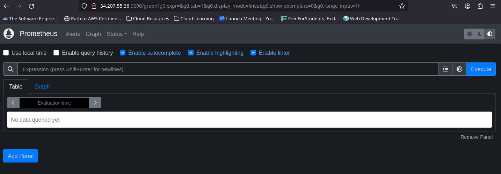
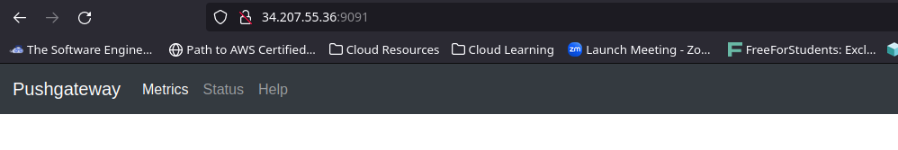
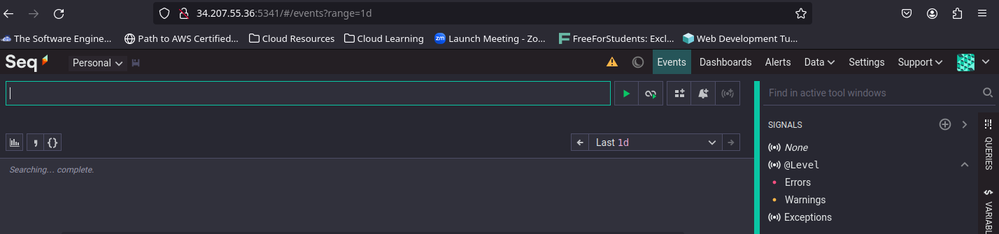

# Nethermind Ethereum Client and Monitoring Stacks Deployment using Terraform on AWS
A quick and straightforward guide to swiftly deploy the Nethermind Client and Monitoring stack (consisting of Grafana, Prometheus, and Seq) using Terraform on AWS.

Majority of the contents in this repository are from [NethermindET](https://github.com/NethermindEth/terraform-nethermind) and [Nethermind Doc](https://docs.nethermind.io)

## Step 1: Cloning Repository
I cloned [NethermindET](https://github.com/NethermindEth/terraform-nethermind) to my localhost and edited the main.tf to conform with AWS terraform resources.

```
git clone https://github.com/NethermindEth/terraform-nethermind
```
```
resource "tls_private_key" "nethermind_pk" {
  algorithm = "RSA"
  rsa_bits  = 4096
}

resource "aws_key_pair" "nethermind_kp" {
  key_name   = "key-pair-nethermind"       # Create a "myKey" to AWS!!
  public_key = tls_private_key.nethermind_pk.public_key_openssh
}

resource "local_file" "ssh_key" {
  filename = "${aws_key_pair.nethermind_kp.key_name}.pem"
  content =  tls_private_key.nethermind_pk.private_key_pem
  file_permission = "400"
}
```
## Step 2: Provisioner Block
I added the `providers.tf` file to the base directory. The configured aws provider is to establish a secure connection between terraform and aws
```
provider "aws" {
  region  = var.region
  profile = "terraform-Dev-user"

  default_tags {
    tags = {
      "Automation"  = "Terraform"
      "Project"     = var.project_name
      "Environment" = var.environment
    }
  }
}
```


## Step 3: Backend Block
I setup `backend.tf` to store the terraform state file in s3 and lock with dynamodb
```
terraform {
  backend "s3" {
    bucket         = "terra-dev-remote-state-2023"
    key            = "nethermind/terraform.tfstate"
    region         = "us-east-1"
    profile        = "terraform-Dev-user"
    dynamodb_table = "terraform-state-lock"
  }
}
```
I created `vpc.tf` file which is the networking section of the server. This includes AWS terraform resources blocks of;
* vpc
* internet_gateway
* subnet
* availability zone
* route table
```
resource "aws_vpc" "vpc" {
  cidr_block           = var.vpc_cidr
  instance_tenancy     = "default"
  enable_dns_hostnames = true
  enable_dns_support = true

  tags = {
    Name = "${var.project_name}-${var.environment}-vpc"
  }
}
```
## Step 3: Terraform Init/Plan/Apply

After a series of debugging and editing the Terraform scripts, I ran `terraform init`, `terraform plan`, and `terraform apply`. Everything applied successfully.

* **Terraform scripts run successfully**


* **Nethermind Ethereum server deployed**
  

* **Grafana UI** (http://34.207.55.36:3000/)
  
  

* **Prometheus UI** (http://34.207.55.36:9090)
  

* **Pushgateway UI** (http://34.207.55.36:9091)
  

* **Seq UI** (http://34.207.55.36:5341)
  

## References
* https://docs.nethermind.io/get-started/installing-nethermind
* https://medium.com/nethermind-eth/deploying-nethermind-ethereum-client-with-monitoring-stack-55ce1622edbd
* https://github.com/NethermindEth/terraform-nethermind